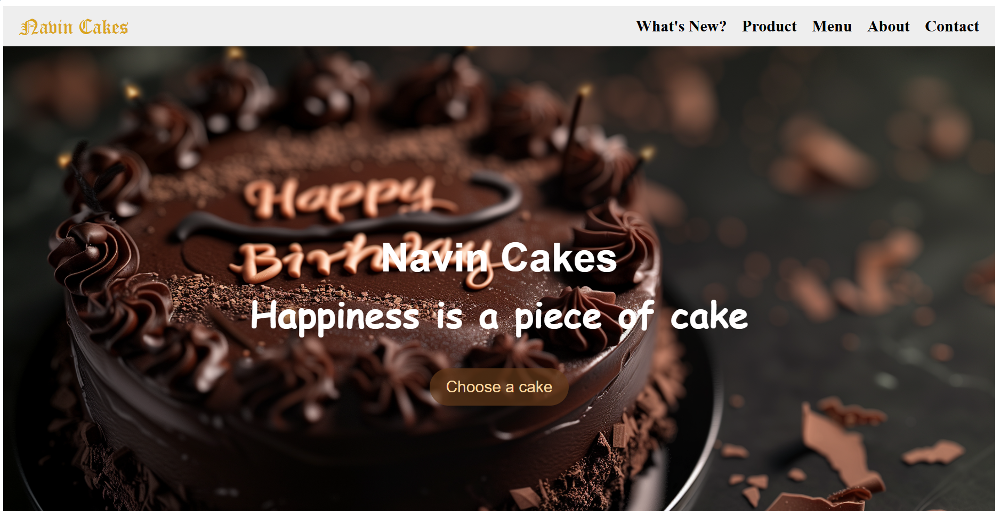
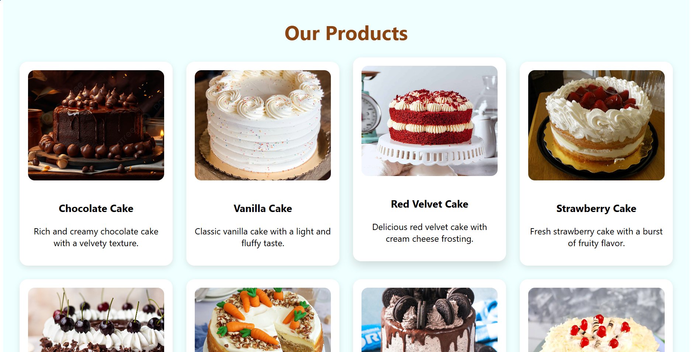
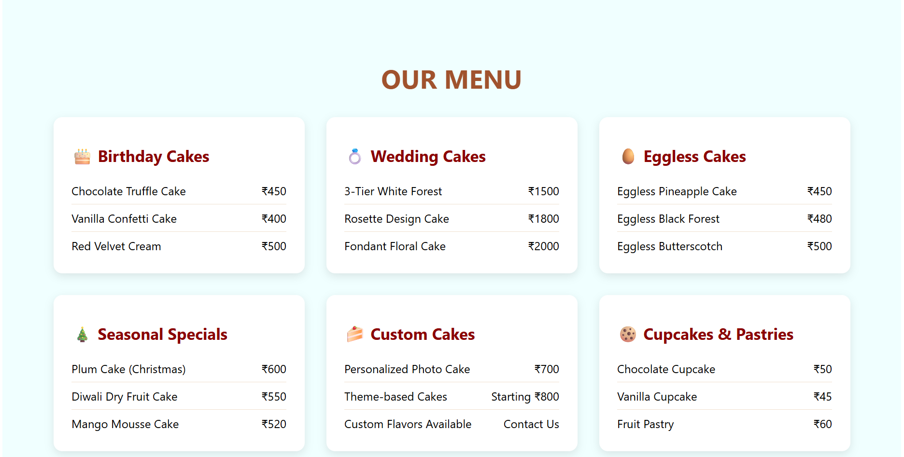
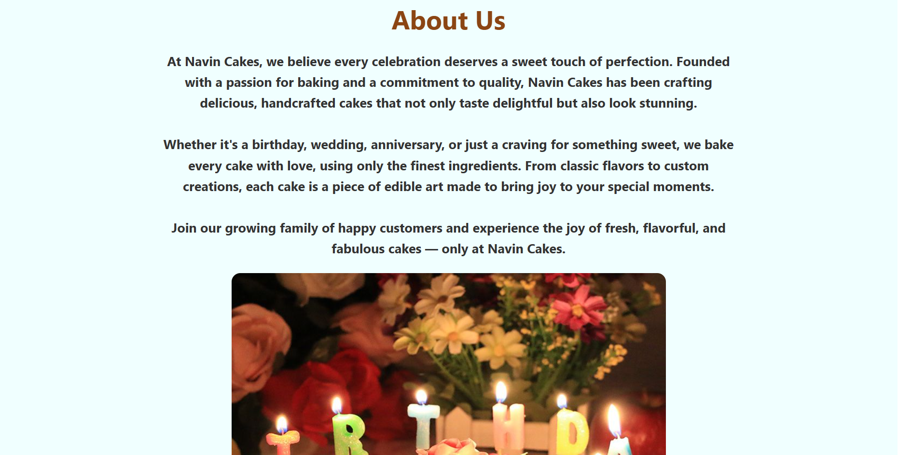
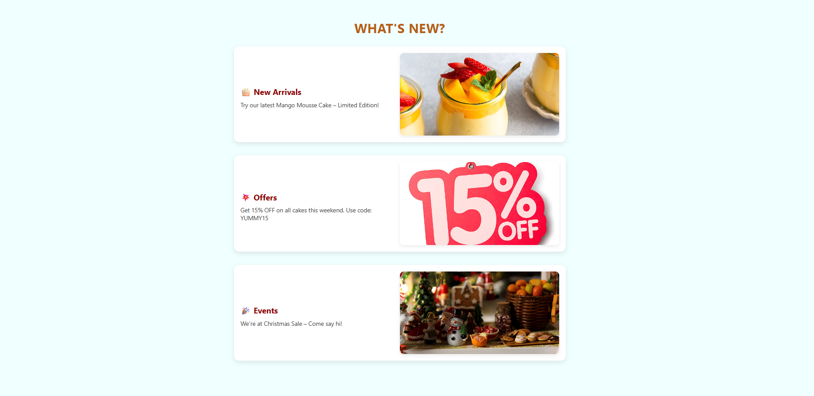
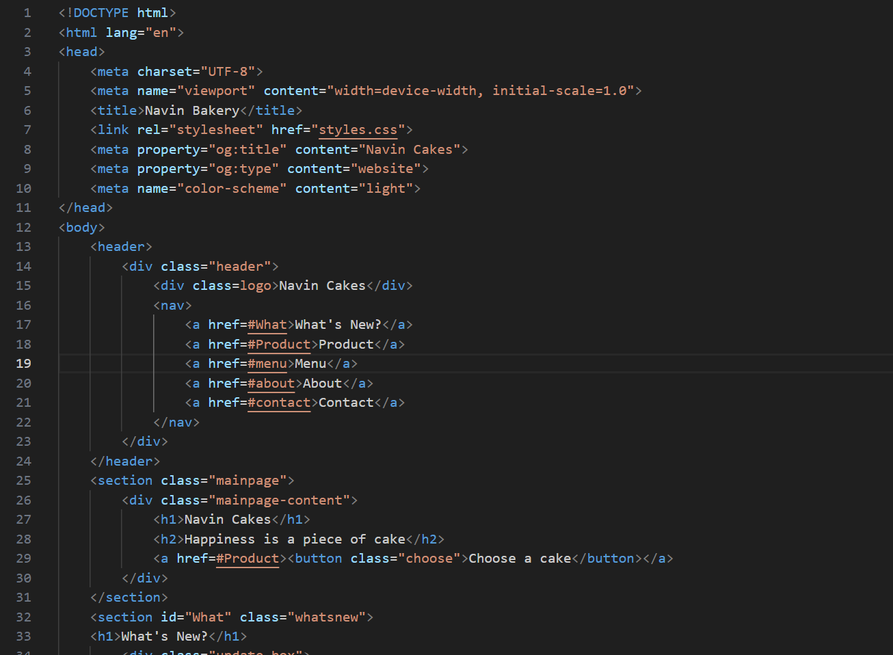

# 🍰 Navin Cakes - Bakery Website Frontend







A beautiful, responsive frontend website for Navin Cakes bakery featuring an elegant design and smooth user experience.

## 🚀 Demo

Check out the live demo: [🔗 Live Site](https://kathir2911.github.io/Bakery_website_frontend/)

## 🖼️ Screenshots



*Beautiful frontend showcasing the bakery's offerings with smooth navigation and responsive design*

## ✨ Features

- **Responsive Design** - Works seamlessly on desktop, tablet, and mobile devices
- **Smooth Scrolling Navigation** - Easy navigation between sections
- **Product Showcase** - Beautiful gallery of cake varieties with descriptions
- **Interactive Menu** - Organized pricing menu with different categories
- **What's New Section** - Latest arrivals, offers, and events
- **About Section** - Company story and mission
- **Contact Information** - Easy ways to get in touch

## 🎨 Sections

1. **Hero Section** - Eye-catching landing area with call-to-action
2. **What's New** - Latest updates, offers, and events
3. **Our Products** - Comprehensive cake gallery (16 different varieties)
4. **Menu** - Categorized pricing menu including:
   - Birthday Cakes
   - Wedding Cakes
   - Eggless Cakes
   - Seasonal Specials
   - Custom Cakes
   - Cupcakes & Pastries
5. **About Us** - Company background and values
6. **Contact** - Business contact information and social media

## 🛠️ Technologies Used

- **HTML5** - Semantic markup structure and foundation
- **CSS3** - Modern styling with:
  - Flexbox and CSS Grid layouts
  - Smooth transitions and hover effects
  - Responsive design principles
  - Custom color scheme and typography
- **JavaScript** - For interactivity and smooth navigation (if applicable)

## 📁 Project Structure

```
Bakery_website_frontend/
├── index.html          # Main HTML file
├── styles.css          # Stylesheet
├── script.js           # JavaScript functionality (if any)
├── images/            # Image assets folder
│   ├── Cake.png       # Hero background image
│   ├── homepage.png   # Homepage screenshot
│   ├── Products.png   # Products section screenshot
│   ├── menu.png       # Menu section screenshot
│   ├── about.png      # About section screenshot
│   ├── what.png       # What's New section screenshot
│   ├── index.png      # HTML code screenshot
│   ├── mango_mouuse_cake.jpg
│   ├── 15_percent_offer.png
│   ├── christmas_sweet.jpg
│   ├── Chocolate_cake.jpg
│   ├── Vanilla_cake.jpg
│   ├── Red_velvet_cake.jpg
│   └── ... (other cake images)
└── README.md          # Project documentation
```

## 🚀 Getting Started

### Prerequisites

- A modern web browser (Chrome, Firefox, Safari, Edge)
- A code editor (VS Code, Sublime Text, etc.)

### Installation

1. **Clone the repository**
   ```bash
   git clone https://github.com/Kathir2911/Bakery_website_frontend.git
   ```

2. **Navigate to the project directory**
   ```bash
   cd Bakery_website_frontend
   ```

3. **Open the website**
   - Double-click `index.html` to open in your default browser
   - Or use a local server (recommended):
     ```bash
     # Using Python
     python -m http.server 8000
     
     # Using Node.js (with live-server)
     npx live-server
     ```

4. **View the website**
   - Open your browser and go to `http://localhost:8000` (if using local server)
   - Or simply open the `index.html` file directly

## 🎯 Usage

The website is fully functional and ready to use. Navigate through different sections using:

- **Header Navigation** - Click on menu items (What's New, Product, Menu, About, Contact)
- **Call-to-Action Button** - "Choose a cake" button on the hero section
- **Smooth Scrolling** - All navigation links smoothly scroll to their respective sections

## 🎨 Customization

### Colors
The website uses a warm, bakery-themed color palette:
- Primary: `#8b4513` (Saddle Brown)
- Secondary: `#b75e19` (Orange Brown)
- Accent: `goldenrod`
- Background: `azure`

### Adding New Products
To add new cake products:
1. Add the product image to the `images/` folder
2. Add a new `product-item` div in the Products section of `index.html`
3. Update the menu section with pricing if needed

### Modifying Content
- **Company Information**: Edit the About section in `index.html`
- **Contact Details**: Update the Contact section
- **Menu Prices**: Modify the menu section pricing

## 📱 Responsive Breakpoints

The website is designed to be responsive with:
- **Desktop**: Full layout with grid displays
- **Tablet**: Adjusted grid columns and spacing
- **Mobile**: Single column layout with optimized touch targets

## 🌟 Key Features Highlight

- **Modern CSS Grid & Flexbox** layouts for perfect alignment
- **Hover Effects** on product cards and buttons
- **Professional Typography** using system fonts
- **Optimized Images** with proper aspect ratios
- **Clean Code Structure** with semantic HTML
- **Cross-browser Compatibility**

## 💡 Future Enhancements

- **Backend Integration** - Add server-side functionality for order placement
- **Shopping Cart** - Implement cart feature for multiple item orders
- **Payment Gateway** - Integrate payment processing system
- **User Authentication** - Add user registration and login
- **Order Tracking** - Real-time order status updates
- **Enhanced Animations** - Add more interactive transitions and effects
- **Accessibility Improvements** - Enhanced screen reader support and keyboard navigation
- **Admin Panel** - Content management system for easy updates

## 🙌 Acknowledgements

Made with ❤️ by [Kathir G](https://github.com/Kathir2911)

Special thanks to:
- Design inspiration from modern bakery websites
- Web development community for CSS techniques and best practices
- All contributors and supporters of this project

## 🤝 Contributing

Contributions are welcome! If you'd like to contribute:

1. Fork the repository
2. Create a feature branch (`git checkout -b feature/AmazingFeature`)
3. Commit your changes (`git commit -m 'Add some AmazingFeature'`)
4. Push to the branch (`git push origin feature/AmazingFeature`)
5. Open a Pull Request

## 📄 License

This project is open source and available under the [MIT License](LICENSE).

## 📞 Contact

**Navin Cakes**
- Email: navincakes@gmail.com
- Phone: +91 12345 67890
- Address: 123 Cake Street, Sweet City, CA 12345

**Social Media:**
- Facebook: Navin Cakes
- Instagram: @navincakes
- Twitter: @navincakes

## 🙏 Acknowledgments

- Design inspiration from modern bakery websites
- Image assets (ensure you have proper licenses for all images)
- CSS techniques and best practices from the web development community

---

*Made with ❤️ for cake lovers everywhere!*